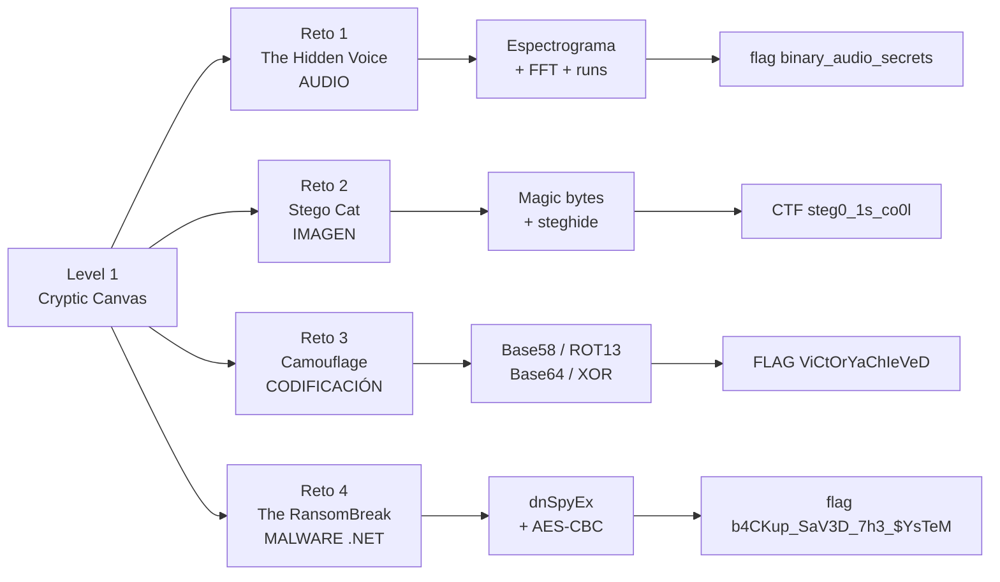
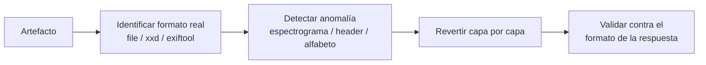
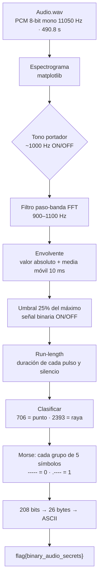
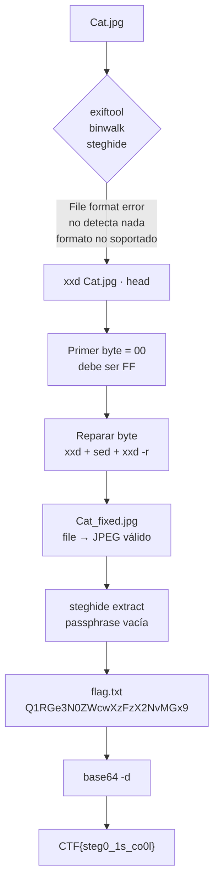
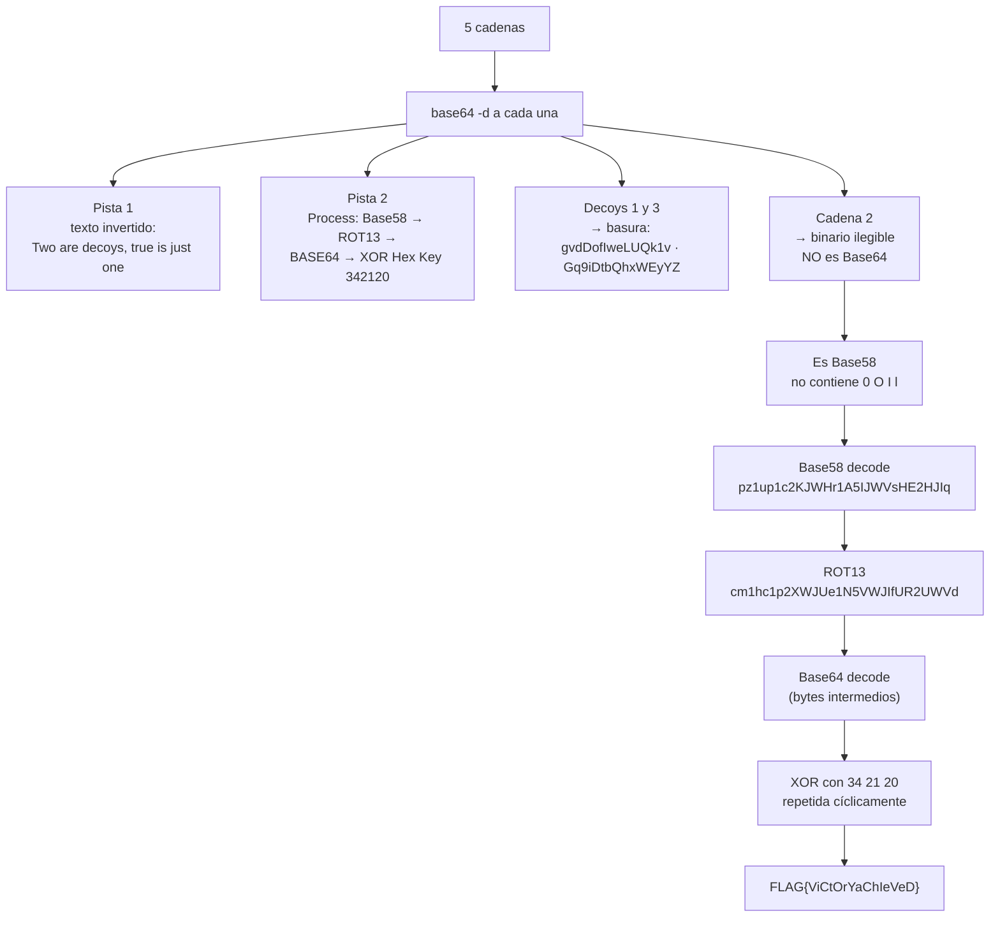
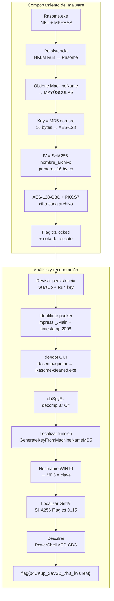

Writeup

> By: B0mb0ncitoo
> Laboratorio de esteganografía, codificación y análisis de malware .NET.
> Entorno: Kali Linux (navegador) + Windows Victim VM.
> Fecha: 2026-10-05

**Herramientas usadas**

- Python 3 (`wave`, `numpy`, `matplotlib`, `collections`)
- `xxd`, `sed`, `file`, `exiftool`
- `steghide`
- `base64`
- `de4dot` GUI (desempaquetado MPRESS)
- `dnSpyEx` (decompilación .NET)
- PowerShell

**Herramientas disponibles en el entorno pero no utilizadas:** Detect It Easy, Ghidra, HxD, PEStudio, API Monitor, Process Hacker, dnSpyEx (x86), x64dbg, etc.

---

## Índice

1. [Resumen ejecutivo](#1-resumen-ejecutivo)
2. [Mapa general del nivel](#2-mapa-general-del-nivel)
3. [Reto 1 — The Hidden Voice](#3-reto-1--the-hidden-voice)
4. [Reto 2 — Stego Cat](#4-reto-2--stego-cat)
5. [Reto 3 — Camouflage](#5-reto-3--camouflage)
6. [Reto 4 — The RansomBreak](#6-reto-4--the-ransombreak)
7. [Mapeo MITRE ATT&CK](#7-mapeo-mitre-attck)
8. [Indicadores de compromiso (IOCs)](#8-indicadores-de-compromiso-iocs)
9. [Remediaciones consolidadas](#9-remediaciones-consolidadas)
10. [Cheat sheet de comandos](#10-cheat-sheet-de-comandos)
11. [Lecciones aprendidas](#11-lecciones-aprendidas)
12. [Fuentes oficiales y referencias](#12-fuentes-oficiales-y-referencias)

---

## 1. Resumen ejecutivo

Se resolvieron **4 retos** con **11 respuestas**:

| # | Reto | Pregunta | Respuesta |
|---|------|----------|-----------|
| 1 | The Hidden Voice | Flag en `Audio.wav` | `flag{binary_audio_secrets}` |
| 2 | Stego Cat | Marcador JFIF | `FF D8 FF E0` |
| 3 | Stego Cat | Flag oculta en `Cat.jpg` | `CTF{steg0_1s_co0l}` |
| 4 | Camouflage | Secuencia de decodificación | `Base58 → ROT13 → Base64 → XOR (Hex Key: 342120)` |
| 5 | Camouflage | Flag final | `FLAG{ViCtOrYaChIeVeD}` |
| 6 | RansomBreak | Ruta del ejecutable | `C:\Users\Admin\AppData\Local\Rasome\Rasome.exe` |
| 7 | RansomBreak | Versión de .NET | `v4.0.30319` |
| 8 | RansomBreak | Packer | `mpress` |
| 9 | RansomBreak | Función generadora de clave | `GenerateKeyFromMachineNameMD5` |
| 10 | RansomBreak | Clave calculada | `037e39a5c57380ea9357167684ca4dd7` |
| 11 | RansomBreak | Flag final | `flag{b4CKup_SaV3D_7h3_$YsTeM}` |

---

## 2. Mapa general del nivel



**Patrón común:** en los cuatro retos hay una **capa de ofuscación o codificación** encima del dato real. El método es siempre el mismo:



---

## 3. Reto 1 — The Hidden Voice

### 3.1 Escenario
`Audio.wav` contiene un mensaje oculto en código Morse. Formato esperado: `flag{xxxxxx_xxxxx_xxxxxxx}` (palabras de 6, 5 y 7 letras).

### 3.2 Cadena de análisis



### 3.3 Reconocimiento inicial

```bash
file Audio.wav
# RIFF (little-endian) data, WAVE audio, Microsoft PCM, 8 bit, mono 11050 Hz

exiftool Audio.wav
strings Audio.wav | head -50     # solo ruido binario: no hay texto embebido
```

Metadatos relevantes: 1 canal, 11 050 Hz, 8 bits, duración 0:08:11.

### 3.4 Espectrograma

En el espectrograma se ve una **línea horizontal brillante a 1000 Hz** interrumpida a intervalos regulares: es una portadora con modulación **OOK** (on-off keying), la forma clásica de transmitir Morse (CW).

```python
import wave, numpy as np
import matplotlib
matplotlib.use("Agg")
import matplotlib.pyplot as plt

w = wave.open('Audio.wav', 'rb')
fr, n, sw = w.getframerate(), w.getnframes(), w.getsampwidth()
raw = w.readframes(n)
data = np.frombuffer(raw, dtype=np.uint8).astype(np.float32) - 128   # 8 bit sin signo → centrado en 0

plt.figure(figsize=(20, 6))
plt.specgram(data, NFFT=1024, Fs=fr, noverlap=512, cmap='viridis')
plt.ylabel("Frecuencia (Hz)"); plt.xlabel("Tiempo (s)")
plt.title("Espectrograma Audio.wav"); plt.colorbar(label="Intensidad (dB)")
plt.tight_layout(); plt.savefig("spec.png", dpi=120)
```

**Por qué `- 128`:** el WAV de 8 bits es *unsigned* (silencio = 128). Hay que centrarlo en 0 antes de hacer FFT, si no el componente DC contamina el espectro.

### 3.5 Lógica de la decodificación

**Filtro paso-banda por FFT** (900–1100 Hz) para quedarse solo con la portadora:

```python
Y = np.fft.rfft(data)
freqs = np.fft.rfftfreq(len(data), 1/fr)
mask = (freqs >= 900) & (freqs <= 1100)
Y_f = np.zeros_like(Y); Y_f[mask] = Y[mask]
filtered = np.fft.irfft(Y_f, n=len(data))
```

**Envolvente + umbral:** `|señal|` suavizada con una ventana de 10 ms (`fr // 100`) y umbral al 25 % del máximo → señal binaria.

**Run-length:** se agrupan muestras consecutivas iguales y se mide su duración.

Resultados medidos:

| Tipo | Muestras | Tiempo | Interpretación |
|------|----------|--------|----------------|
| ON | 706 | ≈ 63.9 ms | punto `.` |
| ON | 2393 | ≈ 216.6 ms | raya `-` |
| OFF | 983 | ≈ 89 ms | espacio entre símbolos de un mismo grupo |
| OFF | 11111 | ≈ 1.005 s | separador entre grupos (cada grupo = 1 bit) |
| OFF | 70 | ≈ 6.3 ms | muy probablemente artefacto de borde (silencio al inicio/fin), no un separador real |

Comprobación de consistencia: hay 1040 pulsos ON = 208 grupos × 5 símbolos. Con 706·k + 2393·(1040−k) = 2 294 715 muestras activas se obtiene **k = 115**, es decir, 115 grupos `.----` (bit 1) y 93 grupos `-----` (bit 0). Cuadra exactamente.

### 3.6 El truco: Morse como transporte de binario

El Morse **no** codifica letras directamente. Usa solo los dígitos Morse `0` (`-----`) y `1` (`.----`) como bits:

```
-----  →  0
.----  →  1
```

208 bits ÷ 8 = **26 bytes** = 26 caracteres ASCII = `flag{binary_audio_secrets}` (5 + 6 + 1 + 5 + 1 + 7 + 1 = 26).

```python
bits = ''.join('0' if g == '-----' else '1' for g in grupos)
flag = ''.join(chr(int(bits[i:i+8], 2)) for i in range(0, len(bits) - 7, 8))
```

> Primer intento: al decodificar como Morse normal salía una lista de `0 1 1 0 0 1 1 0...`. Ese resultado era la pista de que había una **segunda capa** (binario → ASCII).

### 3.7 Alternativas de herramientas (si están disponibles)

```bash
# Sonic Visualiser / Audacity: Analyze → Spectrogram
# multimon-ng (decodifica Morse CW):
multimon-ng -t wav -a MORSE_CW Audio.wav
# sox (generar espectrograma sin Python):
sox Audio.wav -n spectrogram -o spec.png
```

En el entorno del lab no estaban `sox`, `ffmpeg` ni `audacity`, por eso se resolvió solo con Python + numpy.

### 3.8 Remediación / contexto defensivo

El audio es un **canal encubierto**: oculta datos en un archivo aparentemente inocuo.

- **DLP / inspección de contenido** en puntos de salida: marcar archivos multimedia atípicos (duración larga, tono puro constante, entropía anómala).
- **Detección por análisis espectral**: una portadora pura de frecuencia fija con on/off regular es muy distinta del audio natural.
- **Control de egreso**: bloquear o inspeccionar transferencias de audio a destinos externos no corporativos.
- **Higiene de formatos**: normalizar o re-codificar (transcode) archivos multimedia entrantes/salientes destruye la mayoría de mensajes ocultos frágiles.

---

## 4. Reto 2 — Stego Cat

### 4.1 Escenario
`Cat.jpg` parece una imagen normal pero no abre. Hay datos ocultos con esteganografía.

### 4.2 Cadena de análisis



### 4.3 Diagnóstico

```bash
exiftool Cat.jpg              # Error: File format error
binwalk Cat.jpg               # sin resultados
steghide extract -sf Cat.jpg  # "the file format ... is not supported"
xxd Cat.jpg | head -3
# 00000000: 00d8 ffe0 0010 4a46 4946 0001 ...
```

Todas las herramientas fallan por el mismo motivo: **la firma (magic number) está corrupta**. Un JPEG/JFIF válido empieza con:

| Bytes | Significado |
|-------|-------------|
| `FF D8` | SOI — Start Of Image |
| `FF E0` | APP0 — marcador de segmento JFIF |
| `00 10` | longitud del segmento (16 bytes) |
| `4A 46 49 46 00` | identificador `JFIF\0` |

El archivo tenía `00 D8 FF E0` → el primer byte estaba a `00` en vez de `FF`.

**Challenge 2** → `FF D8 FF E0` (formato `XX XN XX XN`).

**Nota sobre binwalk:** `binwalk Cat.jpg` no detectó nada debido al byte corrupto en el header. Al reparar el archivo (ver 4.4) y probar `binwalk -e Cat_fixed.jpg`, la extracción falló con un error de permisos: binwalk exige `--run-as=root` para ejecutar utilidades de terceros (*"Binwalk extraction uses many third party utilities, which may not be secure..."*). El reintento con `--run-as=root` también falló (*"One or more files failed to extract: either no utility was found or it's unimplemented"*): no había utilidades de extracción disponibles en el entorno. Ese intento dejó un archivo basura (`*0P`) en el directorio de trabajo, que se eliminó con `rm \*0P`. La extracción del payload se hizo finalmente con `steghide`.

### 4.4 Reparación

```bash
xxd Cat.jpg | sed '1s/^00000000: 00/00000000: ff/' | xxd -r > Cat_fixed.jpg
file Cat_fixed.jpg      # JPEG image data, JFIF standard 1.01, 197x148
```

Cómo funciona: `xxd` convierte a hexdump legible → `sed` sustituye solo el primer byte de la línea 1 → `xxd -r` revierte a binario.

Alternativa más directa (sobrescribe 1 byte en el offset 0):

```bash
cp Cat.jpg Cat_fixed.jpg
printf '\xff' | dd of=Cat_fixed.jpg bs=1 seek=0 count=1 conv=notrunc
```

### 4.5 Extracción del payload

```bash
steghide extract -sf Cat_fixed.jpg      # passphrase vacía (Enter)
# wrote extracted data to "flag.txt".
cat flag.txt                            # Q1RGe3N0ZWcwXzFzX2NvMGx9
cat flag.txt | base64 -d                # CTF{steg0_1s_co0l}
```

**Pista de que es Base64:** `Q1RG` es `CTF` en Base64. Formato esperado `CTF{xxxxN_Nx_xxNx}` → `steg0` / `1s` / `co0l`.

### 4.6 Remediación / contexto defensivo

- **Validación de tipo por contenido, no por extensión:** verificar magic numbers en los gateways de subida de archivos.
- **Re-codificación de imágenes** (re-encode/resize) en flujos de usuario: elimina payloads de steghide, que viven en bits menos significativos de los coeficientes DCT.
- **Análisis estegoanalítico** (chi-cuadrado, RS-analysis, `stegdetect`/`stegseek` en ejercicios de auditoría) para investigaciones.
- **Contraseñas no vacías** si se usa steghide legítimamente; una passphrase vacía es trivial de probar.
- **Monitorización forense:** archivos con cabecera inválida pero cuerpo JFIF coherente son indicador de manipulación deliberada.

---

## 5. Reto 3 — Camouflage

### 5.1 Escenario
`Encoded_Dump.txt` tiene 5 cadenas que parecen Base64: decoys, pistas y un secreto real.

### 5.2 Contenido

```
--- BEGIN TRANSMISSION ---
Z3ZkRG9mSXdlTFVRazF2                                        ← decoy
2A6fz3V1RQkk4RgpctzF5bPYFCaCXsLLb7Jxot4                     ← SECRETO REAL
R3E5aUR0YlFoeFdFeVla                                        ← decoy
LmVubyB0c3VqIHNpIGV1cnQgLHN5b2NlZCBlcmEgb3dU                ← pista 1
UHJvY2VzczogQmFzZTU4IOKGkiBST1QxMyDihpIgQkFTRTY0IOKGkiBYT1IgKEhleCBLZXk6IDM0MjEyMCk   ← pista 2
--- END TRANSMISSION ---
```

### 5.3 Cadena de análisis



### 5.4 Lógica paso a paso

**Pista 1** (Base64 → texto al revés):
`.eno tsuj si eurt ,syoced era owT` → leída al revés: *"Two are decoys, true is just one."*

**Pista 2** (Base64):
`Process: Base58 → ROT13 → BASE64 → XOR (Hex Key: 342120)`

→ **Respuesta del Challenge 4:** la opción `Base58 → ROT13 → Base64 → XOR (Hex Key: 342120)`.

**Cómo se identifica la cadena real:** el alfabeto Base58 (estilo Bitcoin) **excluye** `0`, `O`, `I` y `l` para evitar confusiones visuales. Los dos decoys contienen una `l` minúscula, por lo que el decodificador Base58 falla (`ValueError`) con ellos. Solo la cadena #2 pasa el filtro.

**Verificación manual del XOR** (clave `34 21 20`, cíclica):

| Byte cifrado | Clave | Resultado |
|--------------|-------|-----------|
| `r` = 0x72 | 0x34 | `F` = 0x46 |
| `m` = 0x6D | 0x21 | `L` = 0x4C |
| `a` = 0x61 | 0x20 | `A` = 0x41 |

### 5.5 Script final

```python
import base64

A58 = '123456789ABCDEFGHJKLMNPQRSTUVWXYZabcdefghijkmnopqrstuvwxyz'

def b58decode(s):
    n = 0
    for c in s:
        n = n * 58 + A58.index(c)       # ValueError si el carácter no es Base58
    r = []
    while n:
        r.append(n & 0xff); n >>= 8
    return bytes(reversed(r))

def rot13(s):
    return s.translate(str.maketrans(
        'ABCDEFGHIJKLMNOPQRSTUVWXYZabcdefghijklmnopqrstuvwxyz',
        'NOPQRSTUVWXYZABCDEFGHIJKLMnopqrstuvwxyzabcdefghijklm'))

def xor(data, key):
    return bytes(b ^ key[i % len(key)] for i, b in enumerate(data))

def decode(cipher, key_hex):
    x = b58decode(cipher).decode('latin-1')   # latin-1: no falla con bytes > 0x7F
    x = rot13(x)
    x = base64.b64decode(x)
    return xor(x, bytes.fromhex(key_hex)).decode('latin-1')

print(decode('2A6fz3V1RQkk4RgpctzF5bPYFCaCXsLLb7Jxot4', '342120'))
# FLAG{ViCtOrYaChIeVeD}
```

**Equivalente en CyberChef** (el propio dump lo insinúa con su comentario):
`From Base58` → `ROT13` → `From Base64` → `XOR` (key `342120`, formato Hex).

### 5.6 Remediación / contexto defensivo

- **Codificación ≠ cifrado.** Base64, Base58, ROT13 y XOR con clave corta y fija son reversibles sin secreto. Nunca deben usarse para proteger datos sensibles.
- **Detección de ofuscación en logs/proxy:** cadenas largas con alfabetos Base64/Base58 en campos que no deberían contenerlas son un indicador clásico (T1027, T1140).
- **Para proteger datos reales:** cifrado autenticado (AES-GCM o ChaCha20-Poly1305) con gestión de claves adecuada.
- **Sandbox de decodificación:** en análisis de pastes/dumps sospechosos, automatizar el desempaquetado multicapa (CyberChef, scripts) sin ejecutar nada.

---

## 6. Reto 4 — The RansomBreak

### 6.1 Escenario
Un ransomware cifró `C:\Users\Admin\Documents\CTF_Vault\`. Hay que analizar la muestra, entender el cifrado, calcular la clave y recuperar `Flag.txt`.

### 6.2 Cadena completa del ataque y análisis



### 6.3 Challenge 1 — Ruta del ejecutable

Se revisó primero la carpeta Startup (solo `desktop.ini`, sin persistencia ahí) y después la clave Run del registro:

```powershell
Get-ChildItem "C:\ProgramData\Microsoft\Windows\Start Menu\Programs\StartUp" -Force
Get-ItemProperty "HKLM:\Software\Microsoft\Windows\CurrentVersion\Run"
# Rasome : C:\Users\Admin\AppData\Local\Rasome\Rasome.exe
```

**Respuesta:** `C:\Users\Admin\AppData\Local\Rasome\Rasome.exe`

Otros puntos de persistencia que conviene revisar siempre:

```powershell
Get-ItemProperty "HKCU:\Software\Microsoft\Windows\CurrentVersion\Run"
Get-ItemProperty "HKLM:\Software\Microsoft\Windows\CurrentVersion\RunOnce"
Get-ScheduledTask | Where-Object {$_.TaskPath -notlike '\Microsoft*'}
Get-CimInstance Win32_Service | Where-Object {$_.PathName -like '*AppData*'}
```

### 6.4 Challenge 2 — Versión de .NET

En dnSpyEx, cabecera de metadatos (**Storage Signature**, ECMA-335): la firma `BSJB` (`424A5342`) va seguida de la cadena de versión:

```
0000080C  424A5342   lSignature  ("BSJB")
00000818  0000000C   iVersionString (longitud)
0000081C  v4.0.30319 VersionString
```

**Respuesta:** `v4.0.30319`

> Esta cadena identifica el **runtime CLR 4.x** (cubre .NET Framework 4.0–4.8), no una versión exacta del Framework. El resumen de dnSpyEx indicaba además `Runtime: .NET Framework 4`.

### 6.5 Challenge 3 — Packer

```
// Rasome.exe
// Entry point: mpress._.Main
// Runtime: .NET Framework 4
// Timestamp: 483D835D (5/28/2008 9:07:57 AM)
```

Dos indicadores concordantes de **MPRESS**:

1. Entry point en el namespace `mpress` y la clase `_`.
2. Timestamp de compilación **fijo en 2008**, anómalo para una muestra de 2025-2026 (los stubs de MPRESS lo traen estático).

**Respuesta:** `mpress`

**Flujo real de análisis del binario empaquetado:**

1. **Identificar el packer** (MPRESS) por el entry point `mpress._.Main` y el timestamp de 2008.
2. **Desempaquetar con de4dot GUI** → genera `Rasome-cleaned.exe`.
3. **Abrir `Rasome-cleaned.exe` en dnSpyEx.**
4. **Analizar el código C#** del namespace `Rasome`.

> **Nota metodológica:** el desempaquetado se realizó con **de4dot GUI**. Se intentó primero con la opción *Advanced String Decryption* activada, pero de4dot devolvió el error `Please enter valid string decryption functions!`. La solución fue **desmarcar esa opción** ("Enable") y volver a pulsar *Deobfuscate*, tras lo cual de4dot detectó MPRESS y generó el binario limpio. Ese binario se abrió después en dnSpyEx para el análisis estático.

### 6.6 Challenge 4 — Función generadora de clave

```csharp
private static byte[] GenerateKeyFromMachineNameMD5()
{
    string text = Environment.MachineName.ToUpperInvariant();
    if (!string.IsNullOrWhiteSpace(text))
    {
        using (MD5 md = MD5.Create())
        {
            byte[] bytes = Encoding.UTF8.GetBytes(text);
            byte[] array = md.ComputeHash(bytes);   // 16 bytes = clave AES-128
            return array;
        }
    }
    return null;
}
```

**Respuesta:** `GenerateKeyFromMachineNameMD5` (formato `XxxxxxxxXxxXxxxXxxxxxxXxxxXXN`: Generate·Key·From·Machine·Name·MD5·**5**).

> El código incluye `Console.WriteLine("[D] k1 (Hex): ...")`: el propio malware **imprime la clave en consola** (resto de depuración). Ejecutado en un sandbox aislado, habría revelado la clave sin análisis estático.

### 6.7 Challenge 5 — Clave de descifrado

El hostname de la VM es `WIN10`:

```powershell
hostname
$name  = "WIN10"
$bytes = [System.Text.Encoding]::UTF8.GetBytes($name.ToUpperInvariant())
$md5   = [System.Security.Cryptography.MD5]::Create()
$hash  = $md5.ComputeHash($bytes)
([System.BitConverter]::ToString($hash)).Replace("-","").ToLower()
# 037e39a5c57380ea9357167684ca4dd7
```

**Respuesta:** `037e39a5c57380ea9357167684ca4dd7` (32 caracteres hex = 16 bytes = AES-128).

> Detalle: el malware aplica `ToUpperInvariant()` al nombre. Con `WIN10` (ya en mayúsculas) da lo mismo, pero en otra máquina un hostname en minúsculas habría producido una clave distinta si no se normaliza.

### 6.8 Challenge 6 — Descifrado de `Flag.txt`

Parámetros reconstruidos del código del malware:

| Parámetro | Valor |
|-----------|-------|
| Algoritmo | AES-128 |
| Modo | CBC |
| Padding | PKCS7 |
| Clave | `MD5("WIN10")` = `037e39a5c57380ea9357167684ca4dd7` |
| IV | `SHA256("Flag.txt")[0:16]` = `aabb75bf191e484476082c573f792f4a` |
| Archivo | `Flag.txt.locked` (32 bytes) |

```csharp
public static byte[] GetIV(string fileName)
{
    using (SHA256 sha = SHA256.Create())
    {
        byte[] array = sha.ComputeHash(Encoding.UTF8.GetBytes(fileName));  // 32 bytes
        byte[] iv = new byte[16];
        Array.Copy(array, iv, 16);                                         // primeros 16
        return iv;
    }
}
```

Script de descifrado (PowerShell):

```powershell
$machineName      = "WIN10"
$originalFileName = "Flag.txt"
$lockedFile       = "C:\Users\Admin\Documents\CTF_Vault\Flag.txt.locked"

$md5 = [System.Security.Cryptography.MD5]::Create()
$key = $md5.ComputeHash([Text.Encoding]::UTF8.GetBytes($machineName.ToUpperInvariant()))

$sha = [System.Security.Cryptography.SHA256]::Create()
$iv  = $sha.ComputeHash([Text.Encoding]::UTF8.GetBytes($originalFileName))[0..15]

$aes = [System.Security.Cryptography.Aes]::Create()
$aes.Key = $key; $aes.IV = $iv
$aes.Mode    = [System.Security.Cryptography.CipherMode]::CBC
$aes.Padding = [System.Security.Cryptography.PaddingMode]::PKCS7

$enc = [IO.File]::ReadAllBytes($lockedFile)
$dec = $aes.CreateDecryptor().TransformFinalBlock($enc, 0, $enc.Length)
[Text.Encoding]::UTF8.GetString($dec)
# flag{b4CKup_SaV3D_7h3_$YsTeM}
```

**Verificación de coherencia:** la flag mide 29 bytes; con PKCS7 se rellena a 32 (3 bytes `0x03`) = 2 bloques AES de 16 bytes = los **32 bytes** del archivo cifrado.

### 6.9 Debilidades criptográficas del ransomware (por qué se pudo recuperar)

| Debilidad | Consecuencia |
|-----------|--------------|
| Clave derivada de dato **público/predecible** (hostname) | Cualquiera con el hostname reconstruye la clave; no hay clave secreta del atacante |
| **MD5** como KDF | No es un KDF: sin sal, sin estiramiento, rápido de calcular |
| **IV determinista** (hash del nombre de archivo) | Mismo nombre + misma clave = mismo IV; el IV debe ser aleatorio por cifrado |
| Sin autenticación (CBC sin HMAC) | Sin integridad: permite manipulación (malleability) |
| Logs de depuración con la clave | Fuga directa de material criptográfico |

Esto es una **excepción**: en ransomware real la clave suele cifrarse con la clave pública del atacante y no puede recuperarse sin él.

### 6.10 Remediación y respuesta a incidentes

**Contención inmediata**

1. Aislar el equipo de la red (no apagar si se quiere preservar memoria volátil).
2. Capturar evidencia: volcado de memoria, copia de la muestra, hash (SHA-256), listado de claves Run.
3. Deshabilitar la persistencia: eliminar `HKLM\...\Run\Rasome` y el binario de `%LOCALAPPDATA%\Rasome\`.
4. Identificar alcance: buscar `*.locked` y la nota de rescate en otros equipos/shares.

```powershell
Remove-ItemProperty -Path "HKLM:\Software\Microsoft\Windows\CurrentVersion\Run" -Name "Rasome"
Get-ChildItem C:\ -Recurse -Filter *.locked -ErrorAction SilentlyContinue
```

**Erradicación y recuperación**

- Recuperar desde **backups offline/inmutables** verificados; reconstruir el equipo si hay duda de integridad.
- Si la muestra es débil (como esta), descifrar con la clave derivada y validar en una copia de los archivos antes de sobrescribir.
- Rotar credenciales usadas en el equipo afectado.

**Prevención**

| Control | Detalle |
|---------|---------|
| Allow-listing de ejecución | AppLocker / WDAC: bloquear ejecutables desde `%LOCALAPPDATA%` y `%TEMP%` |
| Monitorización de persistencia | Alertar en cambios a claves `Run`/`RunOnce` (Sysmon Event ID 13), tareas programadas y servicios nuevos |
| EDR con detección de cifrado masivo | Detección de renombrado/escritura masiva y extensiones nuevas (`.locked`) |
| Detección de empaquetadores | Regla para stubs MPRESS / timestamp 2008 en binarios .NET |
| Backups 3-2-1 | 3 copias, 2 medios, 1 offline/inmutable; pruebas de restauración periódicas |
| Mínimo privilegio | Escribir en `HKLM\...\Run` requiere privilegios elevados: evitar sesiones con admin permanente |
| Macros y adjuntos | Bloquear la vía de entrada típica (phishing); *Attack Surface Reduction* de Defender |

---

## 7. Mapeo MITRE ATT&CK

| Reto | Técnica | ID |
|------|---------|----|
| Hidden Voice | Obfuscated Files or Information | [T1027](https://attack.mitre.org/techniques/T1027/) |
| Hidden Voice / Stego Cat | Steganography | [T1027.003](https://attack.mitre.org/techniques/T1027/003/) |
| Camouflage | Deobfuscate/Decode Files or Information | [T1140](https://attack.mitre.org/techniques/T1140/) |
| RansomBreak | Boot or Logon Autostart: Registry Run Keys | [T1547.001](https://attack.mitre.org/techniques/T1547/001/) |
| RansomBreak | Obfuscated Files: Software Packing | [T1027.002](https://attack.mitre.org/techniques/T1027/002/) |
| RansomBreak | Data Encrypted for Impact | [T1486](https://attack.mitre.org/techniques/T1486/) |

---

## 8. Indicadores de compromiso (IOCs)

| Tipo | Valor |
|------|-------|
| Ruta | `C:\Users\Admin\AppData\Local\Rasome\Rasome.exe` |
| Registro | `HKLM\Software\Microsoft\Windows\CurrentVersion\Run` → `Rasome` |
| Extensión | `.locked` (ej. `Flag.txt.locked`) |
| Packer | MPRESS · entry point `mpress._.Main` |
| PE timestamp | `0x483D835D` (2008-05-28) |
| Runtime | CLR `v4.0.30319` |
| Función | `GenerateKeyFromMachineNameMD5`, `GetIV` |
| Cadena en consola | Prefijos `[D]` / `[E]` de depuración |
| Carpeta afectada | `C:\Users\Admin\Documents\CTF_Vault\` |

---

## 9. Remediaciones consolidadas

| Reto | Riesgo | Remediación clave |
|------|--------|-------------------|
| Audio con Morse/binario | Canal encubierto / exfiltración | DLP, inspección espectral, transcodificación, control de egreso |
| JPEG con steghide | Datos ocultos en imágenes | Validar magic numbers, re-codificar imágenes, estegoanálisis |
| Capas Base58/ROT13/XOR | Falsa sensación de protección | Usar cifrado autenticado real; detectar ofuscación en telemetría |
| Ransomware .NET | Pérdida de datos / persistencia | Aislamiento, backups inmutables, AppLocker/WDAC, monitorización de Run keys |

---

## 10. Cheat sheet de comandos

### Reconocimiento de archivos
```bash
file <archivo>
exiftool <archivo>
strings <archivo> | head -50
xxd <archivo> | head -30
binwalk <archivo>
```

### Esteganografía
```bash
steghide info   <imagen.jpg>
steghide extract -sf <imagen.jpg>             # prueba passphrase vacía
steghide extract -sf <imagen.jpg> -p "clave"
```

### Reparar un byte
```bash
xxd in.jpg | sed '1s/^00000000: 00/00000000: ff/' | xxd -r > out.jpg
printf '\xff' | dd of=out.jpg bs=1 seek=0 count=1 conv=notrunc
```

### Codificaciones
```bash
echo '<cadena>' | base64 -d
echo '<cadena>' | tr 'A-Za-z' 'N-ZA-Mn-za-m'     # ROT13
echo '<cadena>' | rev                              # texto invertido
```

### Hash / cifrado (PowerShell)
```powershell
[BitConverter]::ToString([Security.Cryptography.MD5]::Create().ComputeHash([Text.Encoding]::UTF8.GetBytes("WIN10"))).Replace("-","").ToLower()
Get-FileHash .\Rasome.exe -Algorithm SHA256
```

### Persistencia en Windows
```powershell
Get-ItemProperty "HKLM:\Software\Microsoft\Windows\CurrentVersion\Run"
Get-ItemProperty "HKCU:\Software\Microsoft\Windows\CurrentVersion\Run"
Get-ChildItem "C:\ProgramData\Microsoft\Windows\Start Menu\Programs\StartUp" -Force
```

---

## 11. Lecciones aprendidas

1. **Verifica siempre los magic numbers** (`xxd | head`) antes de fiarte de una herramienta: si todas fallan a la vez, sospecha de la cabecera.
2. **Si un decodificador devuelve basura, cambia de hipótesis**: la cadena #2 de Camouflage parecía Base64 pero era Base58. El alfabeto delata el esquema (`0 O I l` ausentes = Base58).
3. **El resultado intermedio es una pista**: la secuencia `0 1 1 0 0 1 1 0…` del Morse era la señal de una segunda capa (binario → ASCII).
4. **El formato de respuesta** (`xxxxxx_xxxxx_xxxxxxx`, `NNNXNN…`) sirve de checksum: valida longitudes y estructura antes de enviar.
5. **Usa `latin-1`** al operar bytes arbitrarios en Python (XOR, etc.) para evitar `UnicodeDecodeError`.
6. **Analiza el malware sin ejecutarlo** (de4dot + dnSpyEx): da el algoritmo, la derivación de clave y el IV completos.
7. **Ransomware con claves derivadas de datos locales** es recuperable; el real usa criptografía asimétrica.
8. **Comprueba la matemática**: 1040 pulsos = 208 × 5, 29 bytes + padding = 32 bytes. Estas verificaciones confirman que la interpretación es correcta.
9. **Documenta mientras trabajas**: guardar comandos y salidas por reto ahorra tiempo al escribir el informe.

---

## 12. Fuentes oficiales y referencias

**Formatos y estándares**
- ITU-T T.81 — JPEG (marcadores SOI/APP0): <https://www.w3.org/Graphics/JPEG/itu-t81.pdf>
- JFIF 1.02 specification: <https://www.w3.org/Graphics/JPEG/jfif3.pdf>
- ECMA-335 — Common Language Infrastructure (metadatos, firma `BSJB`, cadena de versión): <https://ecma-international.org/publications-and-standards/standards/ecma-335/>
- ITU-R M.1677-1 — International Morse code: <https://www.itu.int/rec/R-REC-M.1677>
- RFC 4648 — Base16, Base32, Base64: <https://www.rfc-editor.org/rfc/rfc4648>
- Base58 y ROT13 no tienen estándar oficial (Base58 proviene de Bitcoin; ROT13 es un cifrado César de desplazamiento 13).

**Criptografía**
- RFC 1321 — MD5 (también ver RFC 6151 sobre debilidades): <https://www.rfc-editor.org/rfc/rfc1321>
- NIST FIPS 197 — AES: <https://csrc.nist.gov/pubs/fips/197/final>
- NIST SP 800-38A — Modos de operación (CBC): <https://csrc.nist.gov/pubs/sp/800/38/a/final>
- NIST FIPS 180-4 — SHA-256: <https://csrc.nist.gov/pubs/fips/180-4/upd1/final>
- PKCS#7 / CMS padding — RFC 5652: <https://www.rfc-editor.org/rfc/rfc5652>
- Microsoft Learn — clase `Aes` en .NET: <https://learn.microsoft.com/dotnet/api/system.security.cryptography.aes>

**Defensa y respuesta a incidentes**
- NIST SP 800-61 Rev. 2 — Computer Security Incident Handling Guide: <https://csrc.nist.gov/pubs/sp/800/61/r3/final>
- MITRE ATT&CK: <https://attack.mitre.org/>
- Microsoft Sysinternals — Sysmon: <https://learn.microsoft.com/sysinternals/downloads/sysmon>
- CISA — #StopRansomware Guide: <https://www.cisa.gov/stopransomware>

**Herramientas**
- Steghide: <https://steghide.sourceforge.net/>
- CyberChef: <https://gchq.github.io/CyberChef/>
- dnSpyEx: <https://github.com/dnSpyEx/dnSpy>
- Detect It Easy *(disponible, no usada en este lab)*: <https://github.com/horsicq/Detect-It-Easy>
- de4dot: <https://github.com/de4dot/de4dot>
- Ghidra *(disponible, no usada en este lab)*: <https://ghidra-sre.org/>
- multimon-ng *(alternativa mencionada, no usada)*: <https://github.com/EliasOenal/multimon-ng>
